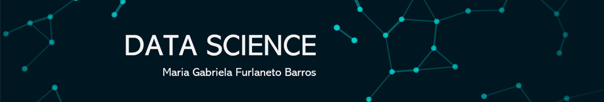

  

# Data Science - Extra Studies 

Nesta sessão serão inseridos conhecimentos vindos de fontes como, cursos, livros e aulas. Assim como a construção de projetos, também é extremamente importante a aquisição de conhecimento. Neste portfolio, meu objetivo geral é armazenar, testar e discutir diversos assunto apreendidos desta fonte. 

Minhas principais fontes de conhecimento, serão anexadas abaixo e ficarão disponíveis os resumso feitos durante a aquisição destes conhecimentos. 

Bora lá??

*REFERENCIAS:* Blog Sigmoidal; Udemy; Data Science do zero; Python; Data Science; Canal Youtube Sigmoidal. 

## Estudos 

1. **Semana Python - Sigmoidal**: (https://github.com/maah-gabs/curso_licoes/blob/master/SemanaPython.ipynb) 
